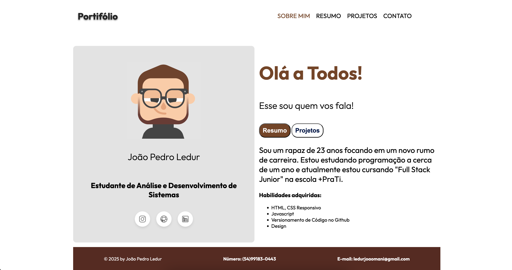

# 📁 Portfólio Pessoal — João Pedro Ledur

Este é o meu portfólio pessoal criado com **HTML** e **CSS**, com um layout responsivo e moderno, inspirado em design flat (como o estilo Duolingo). O objetivo é apresentar quem sou, minhas habilidades técnicas e como entrar em contato comigo.

---

## ✨ Sobre o Projeto

Este portfólio foi desenvolvido como parte do meu processo de aprendizado em desenvolvimento web. Ele foi feito 100% com **HTML5** e **CSS3**, com foco em **responsividade**, **design limpo** e **identidade visual personalizada**.

---

## 📸 Screenshot

---

## 🚀 Funcionalidades

- Layout 100% responsivo
- Design moderno e organizado
- Foto de perfil customizada em 3D
- Botões com hover animado
- Links para redes sociais (Instagram, GitHub, LinkedIn)

---

## 🛠️ Tecnologias Utilizadas

- HTML5
- CSS3
- Google Fonts (Outfit & Roboto)
- Ícones personalizados

---

## 📱 Responsividade

O portfólio se adapta perfeitamente a diferentes tamanhos de tela:
- ✅ Computadores e notebooks
- ✅ Tablets
- ✅ Smartphones

---

